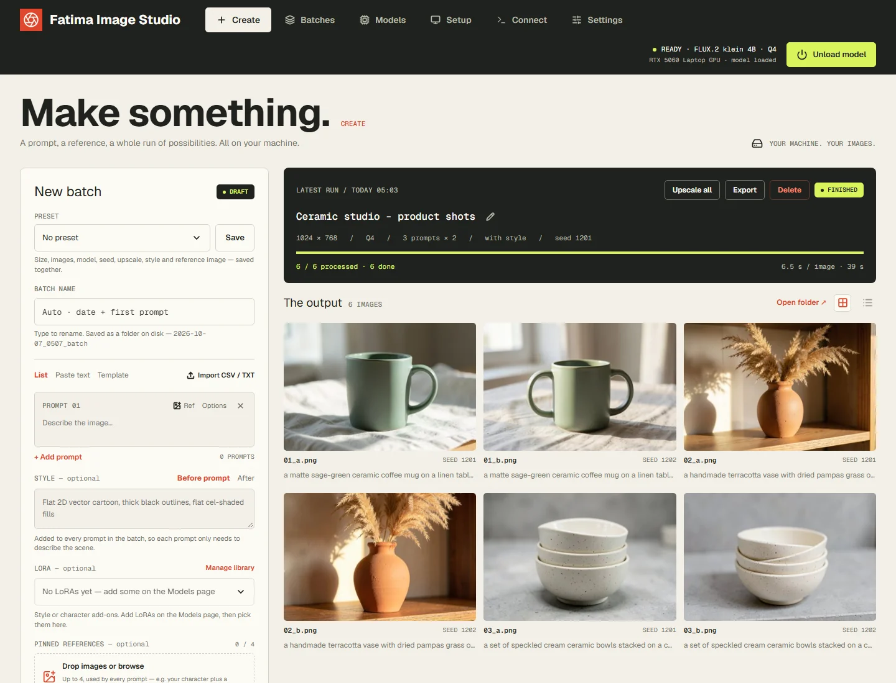
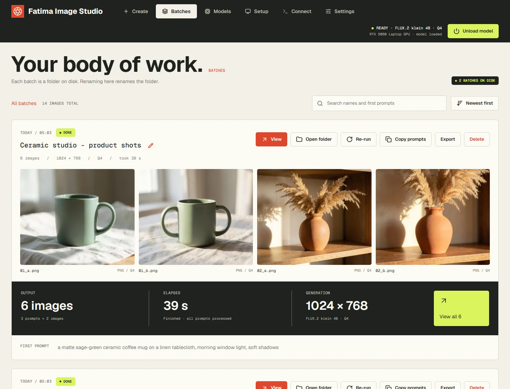
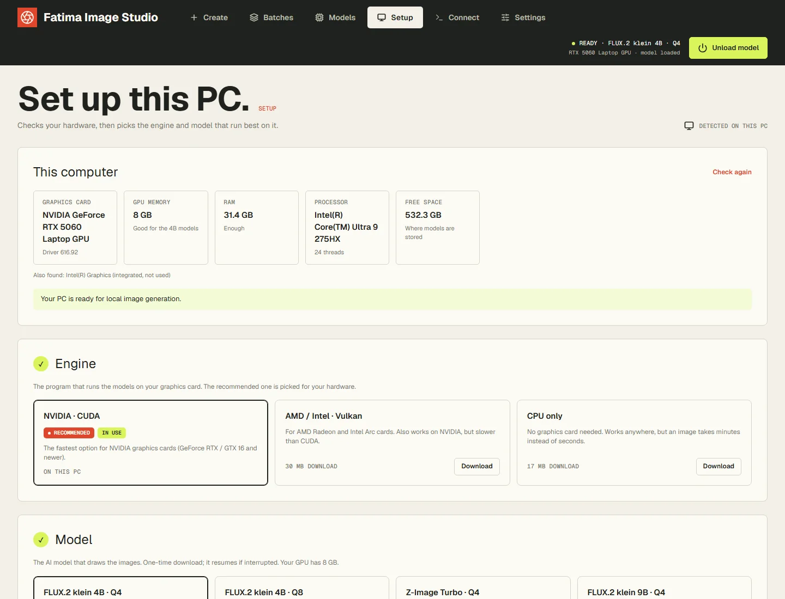
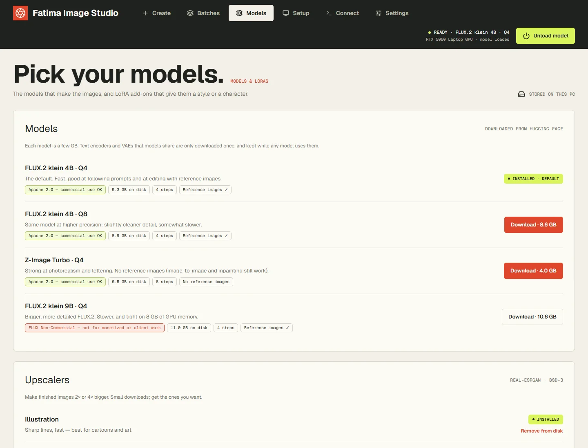
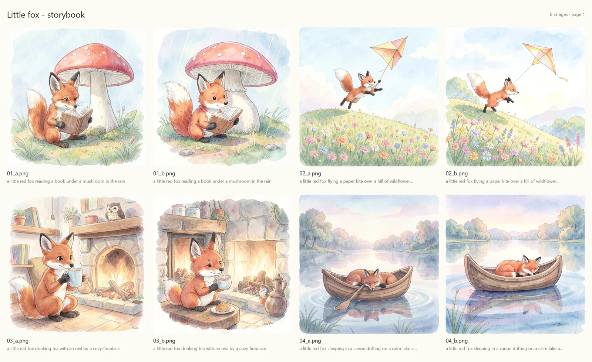

# Fatima Image Studio

[](https://github.com/hassanxs/Fatima-Image-Studio/releases/latest) [](https://github.com/hassanxs/Fatima-Image-Studio/actions/workflows/release.yml) [](https://github.com/hassanxs/Fatima-Image-Studio/releases) [](LICENSE)  

Bulk image generation on your own Windows PC: type or paste many prompts, keep characters consistent with
reference images, and get every batch in its own named, renamable folder. It runs FLUX.2 klein and Z-Image
Turbo locally through the official [stable-diffusion.cpp](https://github.com/leejet/stable-diffusion.cpp)
engine: no cloud, no account, no per-image cost. It also works as an OpenAI-compatible image API and as an
MCP server for AI agents (Claude Code, Codex, Antigravity, Hermes…).



## Screenshots

| Batches | Setup |
|---|---|
|  |  |
| **Models** | **Example output** |
|  |  |

The example is one batch of four prompts with two images each and a shared watercolour style, made with
FLUX.2 klein 4B in under a minute on a laptop RTX 5060 (8 GB).

## Download and install

Get `FatimaImageStudio-Setup-<version>.exe` from the
[latest release](https://github.com/hassanxs/fatima-image-studio/releases/latest) and run it. It installs for
your Windows user only (no admin prompt) and is about 20 MB, because the engine and models aren't bundled:
the app downloads the ones that suit your PC on its **Setup** page, which opens by itself the first time.

The installer isn't code-signed yet, so Windows SmartScreen may say "Windows protected your PC". Choose
**More info → Run anyway**. Each release lists the installer's SHA-256, and the installer is built by GitHub
Actions from the tagged source, so the code you see here is the code you install.

**Updates:** the installed app checks GitHub for a new release when it starts and every 6 hours, and shows
it under **Settings → General → Updates** (a dot on Settings and a short message tell you). Choose
**Quick update** (a few hundred KB: only the app's own files) or **Full update** (the installer). Quick update is
offered when the new version doesn't change the bundled Python or libraries. Both check the download's SHA-256,
keep your models, settings and images, and restart the app by themselves. Automatic checking can be turned off there.

**Uninstall** from Windows Settings → Apps → Installed apps → Fatima Image Studio. It asks whether to also
delete the downloaded models, engine and settings; your images are always kept.

**System requirements:** Windows 10 or 11 (64-bit). Best on an NVIDIA GeForce RTX / GTX 16-series or newer
card with 6 GB or more; AMD and Intel cards work through Vulkan, and CPU-only works but takes minutes per
image. 16 GB of RAM and 10–30 GB of free disk space for models.

## Start

Start **Fatima Image Studio** from the Start menu. It runs in the background with a tray icon and opens
http://127.0.0.1:9820/ in your browser. Starting it again while it runs just opens the page.

Tray menu: open, copy API URL / key, open batches folder, unload model, *Start with Windows*, quit.
The dot on the tray icon shows the engine: none = standby, lime = model loaded, amber = working, red = error.

**Setup** checks the GPU, its memory, RAM, CPU and free disk, warns about problems (old NVIDIA driver, little
memory, running on battery), and downloads the engine build and model that suit this PC, each marked
*Recommended*, with how well every model fits the GPU. It also has *Low-memory mode* (Auto turns it on below
6 GB of GPU memory) and a speed test. On a fresh install it's the only page until an engine and a model are installed; after
that it lives under **Settings → Setup**.

### Run from source

Python 3.11+ on Windows:

```bash
python -m pip install -r requirements.txt
python -m studio
```

`python -m studio` runs it in a console window with the log visible (`start.bat` does the same).
`pythonw -m studio --tray` runs it as the tray app, and `python -m studio --install` adds a Start menu entry
and a launcher in the folder. Run from source, everything (settings, models, engine, batches) stays inside
the project folder.

## Using it

- **Single image** — Create → *Single image*: one prompt (Ctrl+Enter), up to 4 reference images, and the result
  shown large. Single images are made right away, ahead of any running batch, and saved in one
  `YYYY-MM-DD_Singles` batch per day, so the viewer, edits, upscaling and export work on them as usual.
- **Create** — switch to *Batch* and type prompts (Enter adds a row, pasting several lines adds several), switch to *Paste text*,
  or *Import CSV / TXT* (TXT: one prompt per line; CSV: see below).
- **Per-prompt options** — *Options* on a prompt sets its own size, images per prompt or seed; anything
  left on "Batch" uses the batch setting.
- **Reference images** — *Ref* on a prompt row gives that prompt its own reference (or drag an image onto
  the row). The *Batch reference image* applies to every prompt without its own.
- **Batch name** — filled in as `YYYY-MM-DD_HHMM_first-prompt-words`; type over it, or rename later from the
  pencil button. Renaming renames the folder.
- **Template** — write one prompt with `{words}` in braces, give each word a list of values, and add every
  combination (or line 1 with line 1, line 2 with line 2…) to the prompt list.
- **Style** — text added before (or after) every prompt in the batch, e.g. your art style, so prompts only
  describe the scene.
- **Presets** — save size, images per prompt, model, seed, upscale, style and the batch reference image under a
  name; pick it to fill the form in one go. Stored in the data folder (`presets.json`, reference images in `presets\`).
- **Upscale** — choose 2× or 4× when starting a batch (runs after all images are generated), use *Upscale all*
  on a finished batch, or upscale one image from the viewer. Upscaled copies go in `<batch>/upscaled/`;
  originals are kept. *Illustration* (Real-ESRGAN anime 6B) is sharp and fast for cartoons — about 15 s for 4×
  of a 1344×768 image; *Detailed* (Real-ESRGAN x4plus) keeps texture for photos, about 36 s.
- **Pinned references** — up to 4 images every prompt uses (e.g. your character + a setting). A prompt's own
  *Ref* is added on top. Only FLUX.2 models use reference images.
- **New versions of an image** (viewer → *Make a new version*), saved next to the original as `01_a_e1.png`…:
  - *Edit* — describe a change ("make it night"); layout, characters and style are kept.
  - *Vary* — repaint the same shot with new details; the slider sets how far it may move from the original.
  - *Inpaint* — paint over an area and describe what goes there; the rest of the image is untouched.
- **Export** — ZIP of the generated and/or upscaled images (optionally named after the prompt, with
  `batch.json` + `prompts.txt`), or a contact sheet as PDF (12 per page) or one PNG.
- **Queue** — *Up next* can be dragged, or moved with ↑ ↓ / *Run next*. A batch moved above the running one
  starts after the image in progress.
- **Notifications** — the tray shows a Windows notification when a batch finishes (Settings → switch).
- **Models** — the *Models* page downloads, resumes, discards and removes models and upscalers. Each model shows its licence:
  - FLUX.2 klein 4B Q4 / Q8 — Apache 2.0, the default.
  - Z-Image Turbo — Apache 2.0, strong at photorealism and lettering, no reference images, 8 steps.
  - FLUX.2 klein 9B — **non-commercial licence**: not for monetized videos or client work.
  - Qwen-Image 2.1 — excellent readable text and detailed scenes, reference images and editing, transparent PNGs;
    **non-commercial licence** (Qwen Research License). Slow on 8 GB GPUs (about 2–3 minutes per 1024² image).
  - Also available (each shows its licence, size and how well it fits your GPU on the Setup page):
    Qwen-Image and Qwen-Image-Edit 2511 (Apache 2.0; text in images, editing and multi-reference characters;
    16 GB+ GPUs), Z-Image base and Chroma1-HD (Apache 2.0), FLUX.1 schnell (Apache 2.0; small GPUs),
    SDXL 1.0 and Stable Diffusion 1.5 (OpenRAIL; low-end PCs, huge LoRA ecosystem), and — non-commercial —
    FLUX.1 Kontext dev (editing) and FLUX.2 dev (24 GB GPUs).
- **LoRAs** — *Models* page → *LoRA library*: paste a Hugging Face link (or upload a `.safetensors`). The app picks
  the right file, detects which base model it's for from its layer shapes, reads the trigger words and licence
  from the model card, and rewrites FLUX.2 layer names the engine would otherwise skip (without that, only
  about half of a FLUX.2 LoRA applies). On Create, add up to 3 LoRAs with a strength each; their trigger words
  go in front of every prompt. LoRAs only work with their own base model, so switching models drops the others. Recognised families: FLUX.2
  klein 4B / 9B and dev, FLUX.1 (schnell, dev, Kontext — Chroma accepts these too), Chroma, Qwen-Image (and
  Qwen-Image-Edit), Qwen-Image 2.1, Z-Image, SDXL and SD 1.5, in kohya, diffusers, ComfyUI and PEFT formats.
  Files live in `models\loras\`, details in `data\loras.json`; files dropped into the folder are picked up.
- **Viewer** — click any image: ← → to browse, regenerate it (same or new seed; the new image replaces the file),
  copy its prompt, or delete it.
- **Batches** — every past batch, with View, Open folder, Re-run, Copy prompts and Delete. *Select* lets you tick
  several (or *Select all* of those shown, e.g. after a search) and delete them together.
- **Deleting** — batches and single images go to the Windows Recycle Bin, so they can be restored.

CSV columns (header row, any order; only `prompt` is required):

```
prompt,size,images,seed
"A cat on a sofa, morning light",768x1344,2,42
A dog in the snow,,,
```

`size` can also be given as `width` + `height` columns; `images` also accepts `count` or `per_prompt`.
Empty cells use the batch settings.

Batches are processed one image at a time, in the order they were started. Pause lets the current image finish.

- **Seed** — one seed per batch (random if left empty): every prompt's first image uses it, variant b uses
  seed+1, c seed+2… Re-run reuses the same seed, so it reproduces the batch.
- **Model** — loads automatically on the first image and unloads after the idle time in Settings. The header
  button loads it ahead of time, switches Q4/Q8, or unloads it to free GPU memory.

## Where things are

| Installed | From source | What |
|---|---|---|
| `Pictures\Fatima Image Studio\Batches\<batch name>\` | `batches\` | `01_a.png`, `01_b.png`… (prompt number + variant), `refs\`, `upscaled\`, and `batch.json` with every prompt, seed and setting |
| `Pictures\Fatima Image Studio\Exports\` | `exports\` | Where agents (MCP) save images and exports |
| `%LOCALAPPDATA%\Fatima Image Studio\data\` | `data\` | `config.json` (settings and the API key), presets, references, LoRA list, logs |
| `%LOCALAPPDATA%\Fatima Image Studio\models\` | `models\` | Model files, `upscalers\` and `loras\` |
| `%LOCALAPPDATA%\Fatima Image Studio\engine\` | `engine\` | stable-diffusion.cpp `master-929-3f8527a` builds (`cuda`, `vulkan`, `cpu`), downloaded on the Setup page |

The Batches and Exports folders can be changed in Settings. Uninstalling asks whether to delete the models,
engine and settings; your images are always kept.

## API

Base URL `http://127.0.0.1:9820/v1`, header `Authorization: Bearer <api key from Settings>`.

- `POST /v1/images/generations` — `{"prompt", "size": "1024x1024", "n": 1-4, "seed", "model": "flux2-klein-4b-q4" | "flux2-klein-4b-q8", "response_format": "b64_json" | "url"}`
- `POST /v1/images/edits` — multipart with `prompt` and one or more `image` / `image[]` files (reference images); `size` defaults to the first image's size
- `GET /v1/models`, `GET /v1/health`
- `POST /v1/models/{id}/load`, `POST /v1/engine/unload`
- `POST /v1/images/generations` also takes `"loras": [{"name": "…", "strength": 0.8}]` (names from the LoRA library)
- Model ids: `flux2-klein-4b-q4`, `flux2-klein-4b-q8`, `z-image-turbo-q4`, `flux2-klein-9b-q4` (installed ones only)

API requests are served ahead of batch images. The port can be changed in Settings (applies after a
restart). Interactive docs: http://127.0.0.1:9820/docs

## AI agents (MCP)

Fatima Image Studio is also an [MCP](https://modelcontextprotocol.io) server, so AI agents — Claude Code, Codex,
Antigravity, Hermes, or anything else that speaks MCP — can make batches, wait for them, look at the results,
fix weak images, upscale and export. Ready-to-copy setup for each agent is on the **Connect** page.

**Two ways to connect** (Fatima Image Studio must be running for both):

| | Address | Use for |
|---|---|---|
| HTTP (built in) | `http://127.0.0.1:9820/mcp` + header `Authorization: Bearer <api key>` | Claude Code, Codex, Antigravity, Hermes |
| stdio | command `<install folder>\python\python.exe` (or `python` from source), args `["<install folder>\studio_mcp.py"]` | agents that only start local commands |

Examples (replace `<api key>` with the key from the Connect page):

```bash
claude mcp add --scope user --transport http fatima-image-studio http://127.0.0.1:9820/mcp --header "Authorization: Bearer <api key>"
```

```toml
# Codex — ~/.codex/config.toml
[mcp_servers.fatima-image-studio]
url = "http://127.0.0.1:9820/mcp"
http_headers = { "Authorization" = "Bearer <api key>" }
```

```json
// Antigravity — ~/.gemini/config/mcp_config.json
{ "mcpServers": { "fatima-image-studio": { "serverUrl": "http://127.0.0.1:9820/mcp",
                                    "headers": { "Authorization": "Bearer <api key>" } } } }
```

```yaml
# Hermes — ~/.hermes/config.yaml
mcp_servers:
  fatima-image-studio:
    url: "http://127.0.0.1:9820/mcp"
    headers:
      Authorization: "Bearer <api key>"
    timeout: 1800
```

### Tools

| Tool | What it does |
|---|---|
| `list_models`, `list_presets`, `list_loras`, `list_references`, `get_settings` | What's available: models (with licence and whether they take references), presets, LoRAs, named references, folders |
| `generate_image` | One image now (made next, ahead of queued batches), saved in today's Singles batch; returns the batch, file, path and a preview, so the other tools can edit, upscale or export it. With `references` the prompt can be an edit instruction ("make it night"); `images` makes up to 4 variants |
| `create_batch` | A batch: prompts (or `{text, size, images, seed, reference}`), preset, style, size, images per prompt, model, seed, up to 4 `pinned_references`, LoRAs, `upscale` ("2x", "4x detailed") |
| `list_batches`, `get_batch` | Status, progress and every image's path, seed and prompt (`batch` = id, name or `latest`) |
| `wait_for_batch` | Waits until a batch (and its upscales) finishes, up to 30 min per call |
| `view_images` | Small previews of finished images so the agent can check them |
| `edit_image` | New version of a batch image: `edit` (instruction), `vary` (strength) or `inpaint` (mask image) |
| `regenerate_image`, `retry_failed`, `upscale` | Fix-ups |
| `export_batch` | Folder copy, ZIP, or contact sheet (PDF/PNG) into the Exports folder |
| `control_batch`, `rename_batch`, `move_in_queue` | Pause / resume / cancel, rename (folder too), queue order |
| `add_reference` | Save an image under a short name (e.g. `egg-character`) |
| `load_model`, `unload_model` | GPU memory |

**Reference images** can be given as a named reference (`egg-character`), a batch image
(`<batch name>/001_a.png`), an http(s) link, or a file path inside the folders allowed on the Connect page
(Pictures, Downloads and Desktop by default; Batches and Exports always).

**Guard rails:** agents can't download models or delete anything; non-commercial models (FLUX.2 klein 9B) are
refused unless allowed on the Connect page; files are only read from the allowed folders and only written to
the Exports folder from Settings. Calls without the API key are rejected.

## Building the installer

See [`packaging/README.md`](packaging/README.md). In short, `packaging\build.ps1` stages the source with the
official embeddable Python and the pinned packages in `packaging/requirements-lock.txt`, then Inno Setup packs
it. Pushing a `v*` tag makes GitHub Actions build it and attach it to a release.

## Privacy

Fatima Image Studio runs entirely on your PC. It has no telemetry, no analytics and no account. This program
will not transfer any information to other networked systems unless specifically requested by the user or
the person installing or operating it. It only goes online when you ask it to:

- downloading an engine build (from [GitHub](https://github.com/leejet/stable-diffusion.cpp/releases)),
  a model, or an upscaler (from [Hugging Face](https://huggingface.co) and
  [GitHub](https://github.com/xinntao/Real-ESRGAN/releases)), with the Download buttons;
- importing a LoRA from a Hugging Face link you paste, or a reference image from a link you (or your AI agent)
  give it.

Prompts, images and settings never leave your PC. The API and MCP server listen on `127.0.0.1` only and
require the API key. Those download sites have their own privacy policies.

## Licence

MIT, see [`LICENSE`](LICENSE). Third-party software and the models the app can download keep their own
licences: see [`THIRD_PARTY_NOTICES.md`](THIRD_PARTY_NOTICES.md). Check a model's licence before using its
images commercially; the app shows it on every model.
